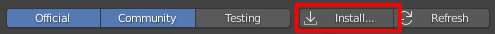

# blender-text2sequences

Plugin add-on to select a group of movie strips and create sequences based on time marks defined in a simple text file.

## Download

Download the addon using [the next link](https://github.com/mondeja/blender-text2sequences/releases/download/0.0.1/text2sequences.py):

```
https://github.com/mondeja/blender-text2sequences/releases/download/0.0.1/text2sequences.py
```

## Install

Under `Edit` -> `Preferences` -> `Add-ons`, press on `Install` and select the
downloaded file:

<p align="center">
  
</p>

## Documentation
