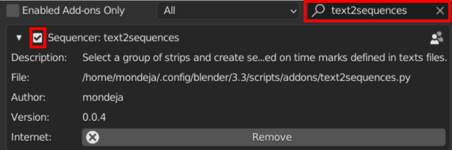

# blender-text2sequences

Plugin add-on to select a group of movie strips and create sequences based on time marks defined in a simple text file.

## Download

Download the addon using [the next link](https://github.com/mondeja/blender-text2sequences/releases/download/v0.0.1/text2sequences.py):

```
https://github.com/mondeja/blender-text2sequences/releases/download/v0.0.1/text2sequences.py
```

## Install

Under `Edit` -> `Preferences` -> `Add-ons`, press on `Install` and select the
downloaded file:

<p align="center">
  
</p>

Search for `Text2sequences` in the search bar and enable the addon marking the
top-left checkbox:

<p align="center">
  
</p>

## Usage

Create a file with a content like:

```txt
1 00:01 00:03
2 00:02 00:04
1 00:03 00:05
2 00:02 00:04
1 00:01 00:02
```

Select two sequences in the Video Sequence Editor:

<p align="center">
  
</p>

Under `Add` menu, you can see that now the `Text to sequences` operator is enabled. Press it and open the text file with time marks. Press `Text to sequences` button and the result will be:

<p align="center">
  
</p>

### Explanation

The plugin builds a continuous sequence based on cuts on the original movie clips.

Channels 2 (movie) and 1 (sound), which compound the first movie channel, is named "1" in the text file and the channel 4 and 3 are "2".

In this example, a continuos sequence will be generated using pieces of the original clips defined by time marks:

- `1 00:01 00:03` -> Cut from second 1 to second 3 of first movie (channels 2 and 1) and place from seconds 0 to 2 of the new sequence.
- `2 00:02 00:04` -> Cut from second 2 to second 4 of first movie (channels 4 and 3) and place from seconds 2 to 4 of the new sequence.
- ...

## Documentation

### Syntax

#### Time marks

The time marks are defined each one in a line with the next format:

```txt
<media-container> <start-time> <end-time>
```

- `<media-container>` (_number_): Number of the media container (movie clip) to use. Starts in 1.
- `<start-time>` (_time_): Start time of the cut in the original movie clip.
- `<end-time>` (_time_): End time of the cut in the original movie clip.

You can create comments starting the line with a `#` character.

#### _time_

Mark times are defined in one of the next regular expressions:

```txt
# <minutes>:<seconds>(.<microseconds>)? (eg. 00:01 or 01:02.345)
(\d+:)?\d+:\d+(\.\d+)

# <hours>:<minutes>:<seconds>(.<microseconds>)? (eg. 00:01:02 or 01:02:03.456)
(\d+:)?\d+:\d+:\d+(\.\d+)

# <frames> (eg. 360 or 690)
\d+
```

### Properties

When you click on `Add` -> `Text to sequences`, the file browser will display a menu at the side with options to customize the generation of the new timeline of sequences.

- <a href="#property-select_new_sequences">#</a> **Select new sequences** (_enabled_): Select the new generated sequences after creating them.
- <a href="#property-select_original_sequences">#</a> **Select original sequences** (_disabled_): Select the original sequences after creating the new ones.
- <a href="#property-mute_original_sequences">#</a> **Mute original sequences** (_disabled_): Mute channels of original movie clips after creating the new ones.
- <a href="#property-mute_new_sequences">#</a> **Mute new sequences** (_disabled_): Mute channels of new movie clips after creating them.
